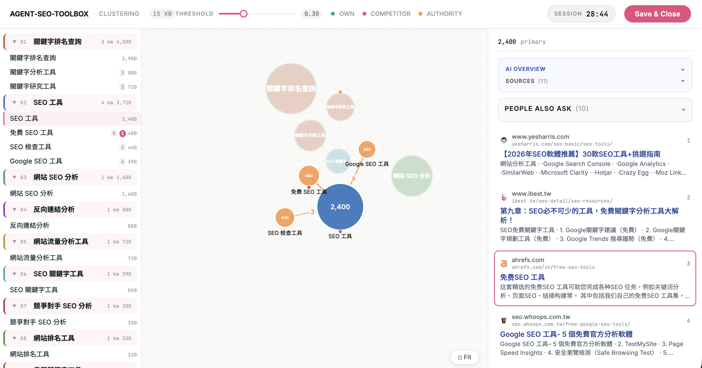

# agent-seo-toolbox

A CLI for Taiwan-market SEO ranking and keyword clustering, designed to be invoked by [Claude Code](https://claude.com/claude-code). Wraps DataForSEO + a shared Neon Postgres cache.

---

## Agent Quickstart (instructions for Claude)

> This section is written for Claude Code. If you're a human reading this — you don't need to follow these steps yourself. Just tell Claude "set up the SEO toolbox" and it will handle everything.

Claude: when a user arrives at this repo for the first time, follow this onboarding flow:

**Step 1 — Offer an environment scan**
Ask the user (via `AskUserQuestion`) whether they'd like you to scan their machine first. Scanning checks: Is `uv` installed? Is `seo` on PATH? Does `~/.config/agent-seo-toolbox/.env` exist? This lets you skip steps they've already completed.

**Step 2 — Ask what they need**
Use `AskUserQuestion` to collect:
- Their website's domain (e.g. `my-clinic.com.tw`)
- Their top competitors (e.g. `competitor-a.com, competitor-b.com`)
- Whether they have credentials from a teammate, or need to sign up for DataForSEO and Neon

Assume the user is non-technical. Use plain language — no jargon, no terminal commands in questions.

**Step 3 — Install and configure**
Run `uv sync --extra dev` if needed. Write `~/.config/agent-seo-toolbox/config.toml` via `seo init --non-interactive`.

For credentials (`DATABASE_URL`, `DATAFORSEO_LOGIN`, `DATAFORSEO_PASSWORD`), **never ask for them in chat**. Instead:

1. Create `~/.config/agent-seo-toolbox/.env` with placeholder comments:
   ```
   # Neon Postgres — copy from your project dashboard → Connection string
   DATABASE_URL=

   # DataForSEO — copy from https://app.dataforseo.com/api-dashboard
   DATAFORSEO_LOGIN=
   DATAFORSEO_PASSWORD=
   ```
2. Open the file in an editor — try VS Code first, fall back to Notepad:
   ```bash
   code ~/.config/agent-seo-toolbox/.env 2>/dev/null || notepad ~/.config/agent-seo-toolbox/.env
   ```
3. If the user doesn't have credentials yet, use the Chrome browser tools (`mcp__claude-in-chrome__*`) to guide them through signup:
   - **Neon** — `https://neon.tech` → create a project → copy the connection string as `DATABASE_URL`
   - **DataForSEO** — `https://dataforseo.com` → create an account → find login/password in the API dashboard
4. Tell the user: "Fill in the three values and save the file, then let me know when you're done."
5. Once they confirm, proceed to Step 4.

**Step 4 — Verify**
Run `seo init --check` and report the result in plain language (not raw JSON).

**Step 5 — First action**
Ask what they want to do: check where a page ranks, or cluster a list of keywords. Then guide them through it.

---

## Quickstart for new collaborators

If a teammate has shared their `.env` with you, this is the fastest path:

```bash
# 1. Clone + install (requires Python 3.11+, uv)
git clone https://github.com/leepoweii/agent-seo-toolbox
cd agent-seo-toolbox
uv sync --extra dev

# 2. Drop in the shared secrets
mkdir -p ~/.config/agent-seo-toolbox
$EDITOR ~/.config/agent-seo-toolbox/.env   # paste DATABASE_URL, DATAFORSEO_LOGIN, DATAFORSEO_PASSWORD
chmod 600 ~/.config/agent-seo-toolbox/.env

# 3. Set your own domain config (interactive)
uv run seo init

# 4. Verify everything connects
uv run seo init --check
# expect: {"config_valid": true, "db_reachable": true, "dataforseo_auth": "ok"}

# 5. Smoke test
echo -e "keyword,volume\n本地 SEO 優化,1200" > /tmp/kw.csv
uv run seo cluster /tmp/kw.csv     # opens browser UI
```

The `.env` contains `DATABASE_URL`, `DATAFORSEO_LOGIN`, `DATAFORSEO_PASSWORD` — **never commit it**. Already in `.gitignore`.

---

## What you get

### `seo rank-check "<keyword>" "<target_url>"`
Find a URL's rank across **Organic**, **AI Overview**, and **Featured Snippet** for any keyword. Outputs JSON with `organic_rank`, `in_ai_overview`, and full `findings[]` array. Cache hit = $0; miss = ~$0.008–0.010.

### `seo cluster keywords.csv`


Read a CSV with `keyword[,volume]` columns, fetch top-10 organic SERPs per keyword (cache-first), and open a **3-panel interactive browser UI**:

- **Explorer panel** — cluster cards with drag-drop keyword management, volume totals, and domain-overlap pills (own / competitor / authority counts per row)
- **D3 force graph** — nodes sized by volume, edges labeled with shared-URL overlap count on hover; hover any node to illuminate its neighborhood and dim the rest
- **SERP sidebar** — click any keyword to inspect its AI Overview, Featured Snippet, People Also Ask, and top-10 organic results

Adjust the threshold slider to recompute clustering live. Click **Save & Close** to write `cluster_state.json` and exit.

Cache hit per keyword: $0. Miss: ~$0.005–0.010.

### `seo init [--check]`
Write `~/.config/agent-seo-toolbox/config.toml` (own domain, competitors). `--check` validates config + Neon + DataForSEO connectivity.

---

## Usage

- **For Claude / agents:** see [CLAUDE.md](CLAUDE.md) — auto-loaded by Claude Code, contains the full command reference, error codes, and command patterns.
- **For humans:** see [docs/install.md](docs/install.md) for full install / upgrade / project-override details and [docs/usage.md](docs/usage.md) for end-to-end examples with real input/output.

## Methodology

See [docs/methodology.md](docs/methodology.md) for academic and industry foundations: SERP-overlap clustering (Zhang et al. SIGIR '11), Jaccard vs. percentage similarity metrics, and the DataForSEO cost model.

## License

MIT
